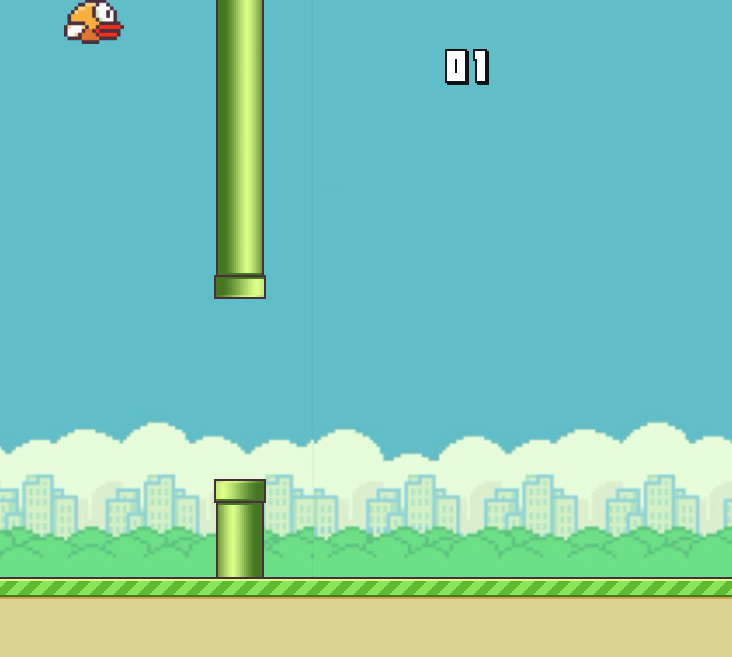

# Flappy Bird Parte 1: Agregando HTML y CSS Base

## Introducción
En éste lab crearás la estructura del juego Flappy Bird en HTML y agregarás estilos con CSS.

## Instrucciones

1. Agrega el siguiente código a `index.html`

```
<!DOCTYPE html>
<html>
  <head>
    <!-- Detalles de Proyecto-->
    <title>Flappy Bird</title>
    <link rel="stylesheet" href="style.css" />
  </head>
  <body>
    <!-- Agregar canvas del juego-->
    <div class="game-container">
      <div class="sky">
        <div class="counter">
          
          
        </div>
        <div class="message"></div>
        <div class="bird"></div>
      </div>
      <div class="obstacles">
        <div class="bottomObstacle"></div>
        <div class="topObstacle"></div>
      </div>
      <div class="ground"></div>
    </div>
  </body>
</html>


```

2. Agrega el codigo css necesario para que al abrir `index.html` se vea lo siguiente en el navegador:

