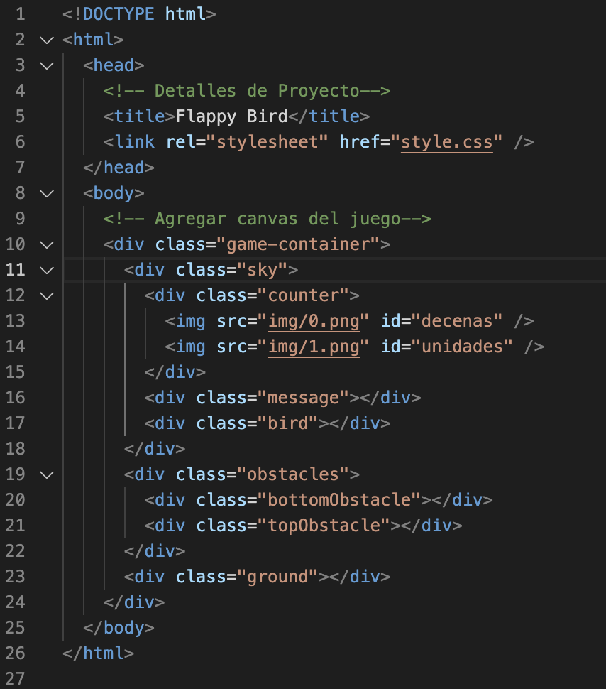

# Flappy Bird Parte 1

## Objetivos

## Introducción

### Funcionalidad del Código
En éste lab crearás la estructura del juego Flappy Bird en HTML y agregarás estilos con CSS.

## Instrucciones

1. Agrega el siguiente código a `index.html`

2. Agrega el codigo css necesario para que al abrir `index.html` se vea lo siguiente en el navegador:

